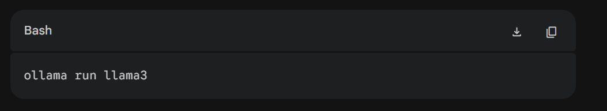
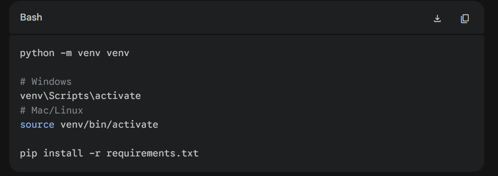
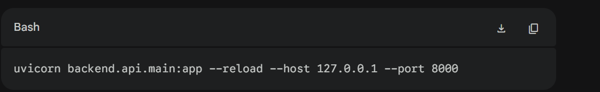
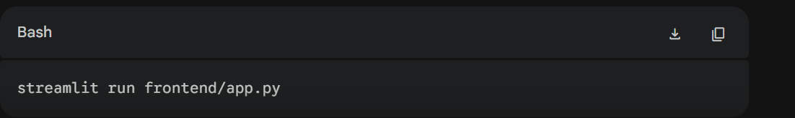

# 🚀 Local Installation & Setup

> Since Sentinel AI runs heavy machine learning models locally, a system with **16GB+ RAM** is recommended for smooth performance.

---

# 1️⃣ Install Ollama (Local LLM Engine)

Sentinel AI requires Ollama to run **Llama 3** locally.

### Step 1 — Download Ollama

Download and install Ollama from:

https://ollama.com

---

### Step 2 — Pull the Llama 3 Model

Open your terminal and run:

```bash
ollama run llama3
```

This is a one-time download (~4.7GB).

Example:



---

### Step 3 — Exit Ollama

After installation completes, type:

```bash
/bye
```

Keep the Ollama application running in the background.

---

# 2️⃣ Clone the Repository

```bash
git clone https://github.com/YOUR_USERNAME/sentinel-ai.git

cd sentinel-ai
```

---

# 3️⃣ Set Up Python Environment

Create a virtual environment and install dependencies.

Example:



## Create Virtual Environment

```bash
python -m venv venv
```

## Activate Environment

### Windows

```bash
venv\Scripts\activate
```

### Mac/Linux

```bash
source venv/bin/activate
```

## Install Dependencies

```bash
pip install -r requirements.txt
```

---

# 4️⃣ Run the Application

You need **two terminal windows** to run the decoupled architecture.

---

## 🖥️ Terminal 1 — Start FastAPI Backend

```bash
uvicorn backend.api.main:app --reload --host 127.0.0.1 --port 8000
```

Example:



---

## 🌐 Terminal 2 — Start Streamlit Frontend

```bash
streamlit run frontend/app.py
```

Example:



---

# ✅ Access the Application

The UI automatically opens at:

```text
http://localhost:8501
```
